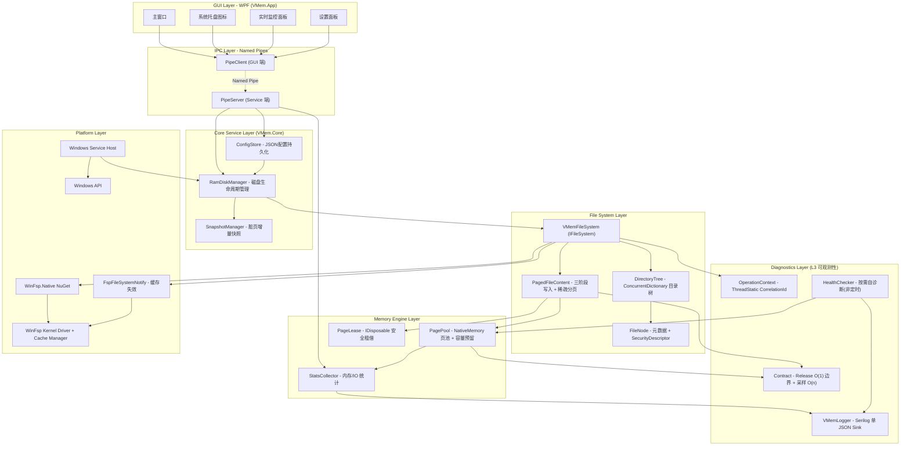

# VMem - Windows 内存虚拟硬盘设计方案（父方案）

> **子方案索引**
>
> | # | 子方案 | 文件 | Phase |
> |---|--------|------|-------|
> | ① | [内存引擎](./vmem_01_memory_engine.plan.md) | PagePool / PageLease / 容量预留 / StatsCollector | 1 |
> | ② | [文件系统与 WinFsp 集成](./vmem_02_file_system.plan.md) | VMemFileSystem / DirectoryTree / 三阶段写入 / 安全模型 / 内核缓存 | 1 |
> | ③ | [IPC 与服务化](./vmem_03_ipc_service.plan.md) | Named Pipe 协议 / Windows Service / 进程模型 | 3 |
> | ④ | [WPF GUI](./vmem_04_gui.plan.md) | 主窗口 / 创建对话框 / 系统托盘 / 实时监控 | 2-3 |
> | ⑤ | [持久化与部署](./vmem_05_persistence_deploy.plan.md) | 脏页快照 / .vmem 镜像格式 / Native AOT / 安装包 | 4 |
> | ⑥ | [测试策略](./vmem_06_testing.plan.md) | 分层测试 / CI / 正确性不变量 / 性能基准 | 全程 |
> | ⑦ | [日志与可观测性](./vmem_07_logging_observability.plan.md) | 结构化日志 / 关联追踪 / 契约检查 / 健康检查 / AI 摘要 | **全程** |

---

## 一、开源生态调研

### 1.1 技术路线分类

| 路线 | 代表框架 | 优势 | 劣势 |
|------|----------|------|------|
| **用户态文件系统** | WinFsp, Dokany | 无需内核开发/签名；完全控制 FS 语义 | Disk Manager 不可见 |
| **用户态块设备** | WinSpd | Disk Manager 可见；用 NTFS 格式化 | 额外 NTFS 开销；Beta 停滞 |
| **SCSI miniport 驱动** | Arsenal Image Mounter | 最接近真实磁盘 | 需驱动安装；AGPL |
| **传统内核驱动** | ImDisk, galpt/temp | 最高性能 | 需 WHQL 签名；Win11 兼容差 |

### 1.2 关键开源项目

| 项目　　　　　　　　　　　　　　　　　　　　　　　　　　　　　　　　　　　| 语言　　 | 框架　　 | GUI　　　| 核心学习点　　　　　　　　　　　　　　　　　　　 |
| ---------------------------------------------------------------------------| ----------| ----------| ----------| --------------------------------------------------|
| [hooyao/RamDrive](https://github.com/hooyao/RamDrive)　　　　　　　　　　 | C#　　　 | WinFsp　 | ✗　　　　| **三阶段写入、容量预留、缓存一致性、TLA+**　　　 |
| [Ceiridge/memefs](https://github.com/Ceiridge/WinFsp-MemFs-Extended)　　　| C++　　　| WinFsp　 | ✗　　　　| **完整 FS 特性（ADS/Reparse/POSIX）、Root SDDL** |
| [winfsp/memfs](https://github.com/winfsp/winfsp/tree/master/tst/memfs)　　| C　　　　| WinFsp　 | ✗　　　　| **官方参考实现、SD 继承标准写法**　　　　　　　　|
| [galpt/temp](https://github.com/galpt/temp)　　　　　　　　　　　　　　　 | C++/C#　 | WDK　　　| WPF　　　| **WPF GUI 交互设计（图表/一键创建）**　　　　　　|
| [tmcdos/ramdisk](https://github.com/tmcdos/ramdisk)　　　　　　　　　　　 | Pascal　 | Arsenal　| Delphi　 | **关机持久化 + 启动恢复流程**　　　　　　　　　　|
| [LTRData/ImDisk](https://github.com/LTRData/ImDisk)　　　　　　　　　　　 | C　　　　| 自有驱动 | 控制面板 | **反面教材：设计老旧→兼容性灾难**　　　　　　　　|
| [DavidXanatos/ImDisk](https://github.com/DavidXanatos/ImDisk)　　　　　　 | C　　　　| 自有驱动 | 控制面板 | **Win11 24H2 兼容修复**　　　　　　　　　　　　　|
| [ArsenalRecon/AIM](https://github.com/ArsenalRecon/Arsenal-Image-Mounter) | C/VB.NET | StorPort | WinForms | **.NET API / NuGet 打包参考**　　　　　　　　　　|
| [dokan-dev/dokany](https://github.com/dokan-dev/dokany)　　　　　　　　　 | C　　　　| 自有 FSD | ✗　　　　| **WinFsp 竞品对比论据**　　　　　　　　　　　　　|
| [winfsp/winspd](https://github.com/winfsp/winspd)　　　　　　　　　　　　 | C　　　　| StorPort | ✗　　　　| **块设备路线理解**　　　　　　　　　　　　　　　 |

> 每个项目的详细调研见对应子方案或下方对比表。

---

## 二、核心技术选型

### 2.1 WinFsp（文件系统层）

- 用户态开发，无需驱动签名
- 启用内核缓存 + Fast I/O 后，缓存读写**超越 NTFS**
- `hooyao/winfsp-native` 提供零分配 .NET 绑定
- 已知局限：Disk Manager 不可见（可接受）

### 2.2 NativeMemory 页池（内存管理）

- 借鉴 hooyao/RamDrive 的 PagePool 架构
- **三阶段写入协议**：页分配移出临界区 → 详见[子方案 ②](./vmem_02_file_system.plan.md)
- **容量预留系统**：SetLength 原子预留 → 详见[子方案 ①](./vmem_01_memory_engine.plan.md)
- **PageLease 安全租借**：异常路径自动归还 → 详见[子方案 ①](./vmem_01_memory_engine.plan.md)

### 2.3 WinFsp 内核缓存

- 默认 `FileInfoTimeout=1000`（元数据缓存），可选 `uint.MaxValue`（完整数据缓存 + Fast I/O）
- 路径变更后调用 `FspFileSystemNotify` 失效缓存 → 详见[子方案 ②](./vmem_02_file_system.plan.md)

### 2.4 WPF（.NET 9 GUI）

- 成熟稳定，适合系统工具类应用 → 详见[子方案 ④](./vmem_04_gui.plan.md)

---

## 三、系统架构



**架构与子方案映射**：
- Memory Engine Layer → [子方案 ①](./vmem_01_memory_engine.plan.md)
- File System Layer → [子方案 ②](./vmem_02_file_system.plan.md)
- IPC Layer + Core Service + Platform → [子方案 ③](./vmem_03_ipc_service.plan.md)
- GUI Layer → [子方案 ④](./vmem_04_gui.plan.md)
- SnapshotManager → [子方案 ⑤](./vmem_05_persistence_deploy.plan.md)
- Diagnostics Layer → [子方案 ⑦](./vmem_07_logging_observability.plan.md)

---

## 四、项目结构

```
vmem/
├── src/
│   ├── VMem.Core/                   # 核心库（.NET 9 类库）
│   │   ├── Memory/                  # → 子方案 ①
│   │   │   ├── PagePool.cs
│   │   │   ├── PageLease.cs
│   │   │   ├── PagedFileContent.cs
│   │   │   └── StatsCollector.cs
│   │   ├── FileSystem/              # → 子方案 ②
│   │   │   ├── VMemFileSystem.cs
│   │   │   ├── DirectoryTree.cs
│   │   │   └── FileNode.cs
│   │   ├── Service/                 # → 子方案 ③
│   │   │   ├── RamDiskManager.cs
│   │   │   └── ConfigStore.cs
│   │   ├── Diagnostics/             # → 子方案 ⑦
│   │   │   ├── VMemLogger.cs
│   │   │   ├── OperationContext.cs
│   │   │   ├── Contract.cs
│   │   │   ├── HealthChecker.cs
│   │   │   ├── DigestWriter.cs
│   │   │   └── FaultInjection.cs    # 故障注入（FAULT_INJECTION 编译开关）
│   │   ├── Abstractions/            # → R81-R90 接口抽象
│   │   │   ├── IPageAllocator.cs
│   │   │   ├── ISnapshotSerializer.cs
│   │   │   └── IVMemPlugin.cs       # V2+ 预留
│   │   ├── Snapshot/                # → 子方案 ⑤
│   │   │   └── SnapshotManager.cs
│   │   └── Ipc/                     # → 子方案 ③
│   │       ├── IpcProtocol.cs
│   │       ├── PipeServer.cs
│   │       └── PipeClient.cs
│   ├── VMem.Cli/                    # Phase 1 CLI 工具（辩论裁决 R13）
│   │   ├── Program.cs               # System.CommandLine 入口
│   │   ├── MountCommand.cs          # mount 子命令（前台阻塞 + Ctrl+C 优雅卸载）
│   │   └── StatusCommand.cs         # status 子命令（TTY=table / 管道=json）
│   ├── VMem.App/                    # → 子方案 ④
│   │   ├── Views/
│   │   ├── ViewModels/
│   │   ├── Services/
│   │   └── App.xaml
│   └── VMem.Service/                # → 子方案 ③
│       ├── VMemWorker.cs
│       └── ServiceInstaller.cs
├── tests/                           # → 子方案 ⑥
│   ├── VMem.Core.Tests/
│   ├── VMem.Integration.Tests/
│   └── VMem.Benchmarks/
├── assets/                          # 设计资源
│   └── icons/                      # SVG 图标集（27 个）
│       ├── vmem-app.svg            # 应用主图标
│       ├── vmem-tray*.svg          # 系统托盘图标（3 种状态）
│       ├── nav-*.svg               # 导航栏图标（4 个）
│       ├── action-*.svg            # 操作按钮图标（6 个）
│       ├── status-*.svg            # 状态指示图标（3 个）
│       ├── preset-*.svg            # 场景预设图标（3 个）
│       ├── disk-*.svg / memory-*.svg / speed-*.svg  # 功能图标
│       ├── tool-*.svg              # 工具图标（3 个）
│       ├── installer.svg           # 安装程序图标
│       └── README.md               # 图标索引与设计指南
├── installer/                       # → 子方案 ⑤
│   └── vmem-setup.iss
├── docs/
│   ├── vmem_ram_disk_design_*.plan.md       # 本文（父方案）
│   ├── vmem_01_memory_engine.plan.md        # 子方案 ①
│   ├── vmem_02_file_system.plan.md          # 子方案 ②
│   ├── vmem_03_ipc_service.plan.md          # 子方案 ③
│   ├── vmem_04_gui.plan.md                  # 子方案 ④
│   ├── vmem_05_persistence_deploy.plan.md   # 子方案 ⑤
│   ├── vmem_06_testing.plan.md              # 子方案 ⑥
│   └── vmem_07_logging_observability.plan.md # 子方案 ⑦
├── VMem.sln
└── README.md
```

---

## 五、关键依赖

| 包 | 版本 | 用途 |
|----|------|------|
| WinFsp.Native | latest | WinFsp .NET 绑定（零分配，AOT 就绪） |
| CommunityToolkit.Mvvm | 8.x | WPF MVVM 框架 |
| LiveChartsCore.SkiaSharpView.WPF | 2.x | I/O 速率实时图表 |
| Hardcodet.NotifyIcon.Wpf | 1.x | 系统托盘图标 |
| System.Text.Json | built-in | 配置 / IPC 序列化 |
| Microsoft.Extensions.Hosting | 9.x | 通用主机（DI + 服务生命周期） |
| System.CommandLine | 2.x | CLI 参数解析（辩论裁决 R13） |
| BenchmarkDotNet | 0.14.x | 性能基准测试 |
| Serilog + Sinks | 4.x | 结构化日志（→ 子方案 ⑦） |
| Polly | 8.x | IPC 客户端重试策略 |
| xUnit | 2.x | 测试框架 |
| coverlet.collector | latest | 代码覆盖率 |

**运行时依赖**：[WinFsp](https://winfsp.dev/rel/) 2.x

---

## 六、开源生态全景对比

### 6.1 技术路线对比

| 维度 | WinFsp (本项目) | WinSpd | Arsenal | 内核驱动 (ImDisk) |
|------|-----------------|--------|---------|------------------|
| 开发难度 | ★★☆ | ★★☆ | ★★★ | ★★★★ |
| 性能 | ★★★★ Fast I/O | ★★★ | ★★★★ | ★★★★★ |
| Disk Manager | ✗ | ✓ | ✓ | ✗ |
| 驱动签名 | 不需要 | 不需要 | 已签名 | **需要 WHQL** |
| .NET 绑定 | winfsp-native (AOT) | 无 | VB.NET | 无 |
| 许可证 | GPL+FLOSS | GPL+FLOSS | **AGPL** | GPL-2.0 |
| 活跃度 (2026) | ★★★★★ | ★ | ★★★ | ★★ |

### 6.2 项目级对比

| 项目 | 框架 | GUI | 三阶段写入 | 容量预留 | 内核缓存 | 安全模型 | 持久化 | AOT |
|------|------|-----|-----------|---------|----------|---------|--------|-----|
| hooyao/RamDrive | WinFsp | ✗ | ✓ | ✓ | ✓ Notify | 基础 | ✗ | ✓ |
| Ceiridge/memefs | WinFsp | ✗ | ✗ | ✗ | ✓ -f | 完整 SD | ✗ | - |
| galpt/temp | WDK | WPF | ✗ | ✗ | 内核级 | 内核级 | ✗ | ✗ |
| tmcdos/ramdisk | Arsenal | Delphi | ✗ | ✗ | 内核级 | NTFS | ✓ | ✗ |
| ImDisk | 自有驱动 | 控制面板 | ✗ | ✗ | 内核级 | 驱动级 | ✓ | ✗ |
| **VMem** | **WinFsp** | **WPF** | **✓** | **✓** | **✓ Notify** | **WinFsp SD** | **✓ 增量** | **Phase 4** |

---

## 七、开发路线

### Phase 1 - 核心文件系统（MVP）— 4 周，CLI 单进程

> **关键决策（经 20 轮 Agent 辩论确定）**：
> - Phase 1 = **CLI 单进程挂载**，不含 Service/GUI/IPC
> - CLI 框架 = System.CommandLine 2.x；前台阻塞 + CancelKeyPress 优雅卸载（R13）
> - 退出码：VmErrorCode→0-7 + 130=Ctrl+C + 2=用法错误（R13）
> - 默认 `EnableKernelCache=false`（Safe 模式），Notify 代码同期实现但守卫
> - winfsp-tests 对已支持特性 **100% 通过**；不支持特性 **explicit skip**
> - 日志 V1 = 单 JSON Sink + Warning 默认 + ThreadStatic CorrelationId
> - Contract Release 仅 O(1) 边界检查；O(n) 改采样或 Dispose 时
> - Config V1 = CLI 参数，无 config.json
> - Children ConcurrentDictionary 必须 OrdinalIgnoreCase（R19/R20 P0）
> - 0 字节文件 = Content 非 null 空实例（R19）
> - AOT CI 门禁从 Phase 1 开始（R18）
> - IPageAllocator 接口抽象 PagePool 内存分配（四巨头 R81-R90）
> - TryReserve CAS 增加后置校验防超额（四巨头 R1-R10）
> - Rename 先检查后 Remove 避免 rollback 原子性问题（四巨头 R1-R10）
> - Write Phase 1 用 stackalloc/ArrayPool 替代 List 减少 GC（四巨头 R21-R30）
> - 故障注入框架：FAULT_INJECTION 编译开关（四巨头 R71-R80）
> - SecurityDescriptor Get/Set 深拷贝（四巨头 R11-R20）
> - BatchLease 增加 ObjectDisposedException + double-commit 防护（四巨头 R1-R10）

| 周次 | 任务 | 子方案 | 验收标准 |
|------|------|--------|----------|
| W1 | PagePool + PageLease + Reserve CAS | ① | 10 条单测全绿 + Return 清零验证 |
| W1 | FileNode：RefCount/PendingDelete/SD（memfs 状态转移表） | ② | 状态机单测 |
| W1 | Lock Hierarchy 文档写入子方案 ② | ② | L0→L1→L2→L3 + Notify 解锁后 |
| W2 | DirectoryTree：ConcurrentDictionary + 字典序 per-parent Lock | ② | Rename 不死锁 |
| W2 | PagedFileContent：三阶段写入 + TOCTOU + RWLS | ② | 8 条单测 |
| W3 | VMemFileSystem 17 回调（Cleanup/Close 严格 memfs 时序） | ② | Notify 守卫 |
| W3 | 安全模型：Root IU SDDL + GetSecurityByName + 继承 | ② | SD 测试 |
| W3 | CLI：`vmem mount --cache safe|balanced|fast`（默认 safe） | ③ | 可挂载 |
| W4 | winfsp-tests @ Safe → 100%（skip list 仅不支持特性） | ⑥ | 合规门禁 |
| W4 | 缓存一致性测试 @ Fast（Rename→Read, Delete→Exists） | ⑥ | P1 软门禁 |
| W4 | 集成测试 8 线程 1 分钟 + 泄漏检测 | ⑥ | RentedPages==0 |
| W4 | 日志：Debug CorrelationId 全链路；Release Warning 默认 | ⑦ | 骨架可用 |
| W4 | docs/known-skips.md + Phase 1 验收表 | ⑥ | 交付物 |
| W4 | 契约对齐检查点：DiskConfig/VmErrorCode/OperationContext 一致 | 全部 | 跨方案验证 |

### Phase 2 - GUI 应用

| 任务 | 子方案 | 验收标准 |
|------|--------|----------|
| WPF 主窗口 + MVVM | ④ | 展示已挂载磁盘列表 |
| 创建磁盘对话框 | ④ | 盘符/容量/页大小/缓存 |
| 系统托盘 | ④ | 最小化到托盘 |

### Phase 3 - 服务化与监控

| 任务 | 子方案 | 验收标准 |
|------|--------|----------|
| Named Pipe IPC | ③ | 跨进程通信 + PipeSecurity |
| Windows Service | ③ | 开机自启；GUI 崩溃不影响磁盘 |
| 实时监控 | ④ | I/O 速率图；1 秒刷新 |
| 配置持久化 | ③ | JSON 自动挂载列表 |

### Phase 4 - 高级功能

| 任务 | 子方案 | 验收标准 |
|------|--------|----------|
| 脏页增量快照 | ⑤ | 5 分钟周期；启动恢复；preshutdown |
| TEMP/缓存映射 | ⑤ | Junction 映射/卸载恢复 |
| Native AOT | ⑤ | CLI 单文件可执行 |
| 安装包 | ⑤ | Inno Setup；捆绑 WinFsp |

---

## 八、错误处理与 NtStatus 映射

### 8.1 VmErrorCode（跨层统一错误码）

> **辩论裁决 R10**：Phase 1 定义最小集，IPC/GUI 复用。

```csharp
public enum VmErrorCode
{
    Success = 0,
    DiskFull = 1,        // PagePool 耗尽 → STATUS_DISK_FULL
    DriveInUse = 2,      // 盘符被占用
    InvalidArgument = 3, // 参数校验失败
    Internal = 4,        // 未预期内部异常
    Unauthorized = 5,    // IPC 鉴权失败（Phase 3）
    RateLimited = 6,     // IPC 限速（Phase 3）
}
```

### 8.2 NtStatus 映射表

| 场景 | NtStatus | VmErrorCode | 说明 |
|------|----------|-------------|------|
| 内存池耗尽 | `STATUS_DISK_FULL` | DiskFull | TryRent / TryReserve false |
| 文件已存在 | `STATUS_OBJECT_NAME_COLLISION` | — | TryAdd false |
| 文件不存在 | `STATUS_OBJECT_NAME_NOT_FOUND` | — | Lookup null |
| 目录非空 | `STATUS_DIRECTORY_NOT_EMPTY` | — | Children > 0 |
| 路径无效 | `STATUS_OBJECT_NAME_INVALID` | InvalidArgument | 解析失败 |
| 访问被拒 | `STATUS_ACCESS_DENIED` | Unauthorized | 内核 SD / IPC Token |
| 共享冲突 | `STATUS_SHARING_VIOLATION` | — | 内核处理 |
| NativeMemory OOM | `STATUS_INSUFFICIENT_RESOURCES` | DiskFull | AllocZeroed 失败 |
| 内部异常 | `STATUS_UNEXPECTED_IO_ERROR` | Internal | catch-all |
| 容量预留超限 | `STATUS_DISK_FULL` | DiskFull | TryReserve false |
| Contract O(1) 边界违反 | 拒绝当前操作 + ERR 日志 | Internal | 不 silent continue |

---

## 九、文件系统元数据规格

| 属性 | 值 | 说明 |
|------|-----|------|
| 文件系统名称 | `VMEM` | GetVolumeInfo |
| 卷标 | 用户自定义 | 默认 "VMem RAM Disk" |
| 扇区大小 | 4096 bytes | 与 PageSize 对齐（R43 FileSystemHost.SectorSize=4096） |
| 分配单元 | PageSize | 默认 4096 |
| 最大文件名 | 255 字符 | NTFS 兼容 |
| 大小写 | 不敏感 | OrdinalIgnoreCase |
| 硬链接 / 符号链接 / ADS | Phase 1 不支持 | 可扩展（memefs 已实现） |
| TRIM/Discard | 支持 | 立即归还页面 |
