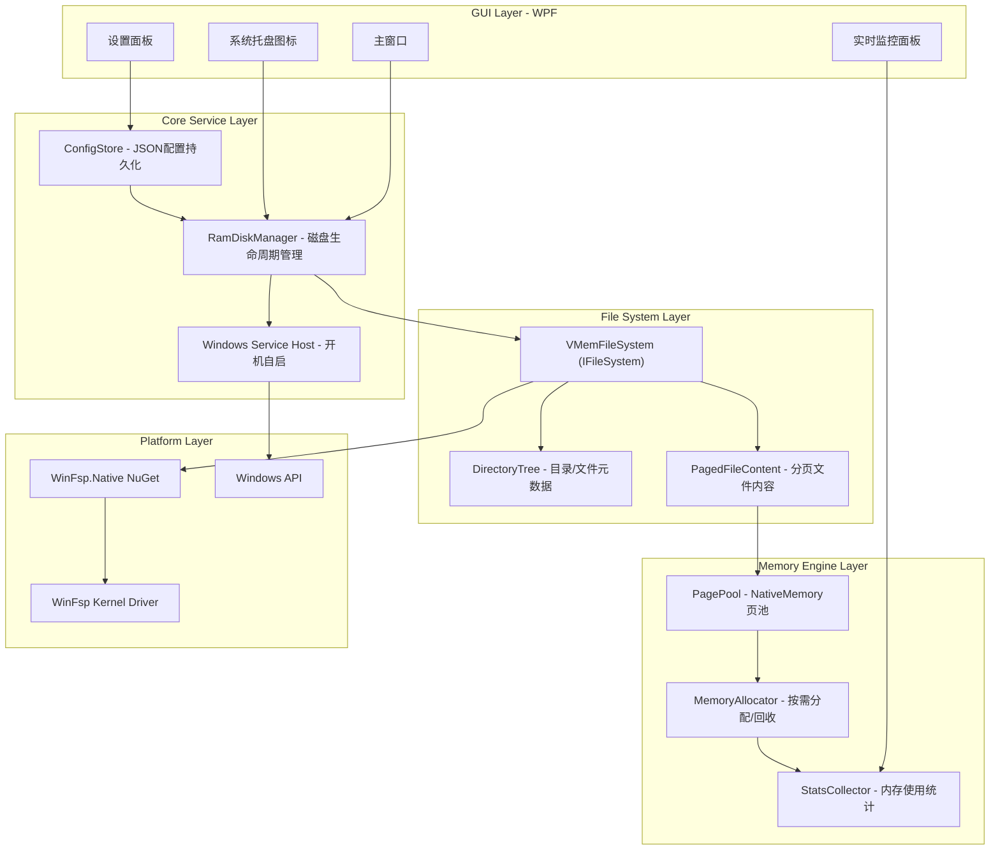

# VMem - Windows 内存虚拟硬盘设计方案

## 一、站在巨人肩膀上：核心技术选型

### 1.1 文件系统层：WinFsp（Windows File System Proxy）

**为什么选它：**
- 业界公认的 Windows 用户态文件系统标准框架（相当于 Linux 的 FUSE）
- 无需编写内核驱动，不需要 WHQL 驱动签名认证
- 内核态 FSD + 用户态 DLL 架构，性能接近原生
- 提供 .NET / C / C++ 多语言 API
- GitHub 12k+ stars，活跃维护

**学习对象：**
- [winfsp/winfsp](https://github.com/winfsp/winfsp) - 核心框架
- [hooyao/winfsp-native](https://github.com/hooyao/winfsp-native) - 零分配、AOT 就绪的 .NET 绑定

### 1.2 内存管理：借鉴 hooyao/RamDrive 的 PagePool 架构

**学习要点：**
- NativeMemory 页池：所有文件数据存储在 GC 堆外，零 GC 压力
- 无锁页分配：ConcurrentStack + 批量 TryPopRange/PushRange
- 按需分配（稀疏文件）：未写入区域不消耗内存
- 每文件 ReaderWriterLockSlim：并发读不互斥

### 1.3 动态内存策略：借鉴 WinFsp-MemFs-Extended

**学习要点：**
- 不预分配全部磁盘大小，按实际使用量动态分配
- 向量化扇区存储，减少碎片
- 总容量限制而非单文件限制

### 1.4 GUI 框架：WPF（.NET 9）

**为什么选 WPF 而非 WinUI 3：**
- WPF 更成熟稳定，适合系统工具类应用
- WinUI 3 的 DependencyProperty 性能问题对数据密集型 UI 不利
- WPF 在 .NET 9 上完全支持，可与核心逻辑共享同一进程
- 社区资源丰富，调试工具完善

---

## 二、系统架构



---

## 三、核心模块设计

### 3.1 内存引擎（Memory Engine）

```csharp
// 页池 - 学习自 hooyao/RamDrive
public sealed class PagePool : IDisposable
{
    private readonly ConcurrentStack<nint> _freePages;
    private readonly int _pageSize;      // 默认 64KB
    private readonly int _maxPages;      // 容量上限
    private int _allocatedCount;         // CAS 原子计数

    public nint Rent();                  // O(1) 无锁获取
    public void Return(nint page);       // O(1) 无锁归还
    public int RentBatch(Span<nint> pages); // 批量获取
}

// 分页文件内容 - 稀疏分配
public sealed class PagedFileContent
{
    private nint[] _pageTable;           // 页表：index -> 原生内存指针
    private readonly PagePool _pool;
    private ReaderWriterLockSlim _lock;

    public int Read(long offset, Span<byte> buffer);
    public int Write(long offset, ReadOnlySpan<byte> data);
    public void SetLength(long newLength);
}
```

### 3.2 文件系统层（File System）

```csharp
// 实现 WinFsp.Native 的 IFileSystem 接口
public sealed class VMemFileSystem : IFileSystem
{
    private readonly DirectoryTree _tree;
    private readonly PagePool _pool;

    // WinFsp 回调
    public NtStatus Create(string fileName, CreateOptions options, ...);
    public NtStatus Read(object fileNode, Memory<byte> buffer, ...);
    public NtStatus Write(object fileNode, ReadOnlyMemory<byte> buffer, ...);
    public NtStatus GetVolumeInfo(out VolumeInfo info);
    // ... 其他 30+ 文件系统操作
}
```

### 3.3 GUI 主要功能

| 功能 | 说明 |
|------|------|
| 创建/删除虚拟盘 | 选择盘符(A-Z)、设置容量、文件系统名 |
| 实时监控 | 已用/总容量、文件数、I/O 速率图表 |
| 自动挂载 | 开机自动创建指定配置的 RAM 盘 |
| 系统托盘 | 最小化到托盘，右键快速管理 |
| 内容持久化(可选) | 关机前将内容保存到磁盘镜像 |
| 文件夹映射 | 将 TEMP/浏览器缓存等映射到 RAM 盘 |

---

## 四、项目结构

```
vmem/
├── src/
│   ├── VMem.Core/              # 核心库（.NET 9 类库）
│   │   ├── Memory/
│   │   │   ├── PagePool.cs
│   │   │   ├── PagedFileContent.cs
│   │   │   └── MemoryAllocator.cs
│   │   ├── FileSystem/
│   │   │   ├── VMemFileSystem.cs
│   │   │   ├── DirectoryTree.cs
│   │   │   └── FileNode.cs
│   │   ├── Service/
│   │   │   ├── RamDiskManager.cs
│   │   │   └── ConfigStore.cs
│   │   └── Stats/
│   │       └── StatsCollector.cs
│   ├── VMem.App/               # WPF GUI 应用
│   │   ├── Views/
│   │   │   ├── MainWindow.xaml
│   │   │   ├── CreateDiskDialog.xaml
│   │   │   └── MonitorView.xaml
│   │   ├── ViewModels/
│   │   │   ├── MainViewModel.cs
│   │   │   ├── DiskViewModel.cs
│   │   │   └── MonitorViewModel.cs
│   │   ├── Services/
│   │   │   └── TrayIconService.cs
│   │   └── App.xaml
│   └── VMem.Service/           # Windows Service（开机自启）
│       └── VMemWorker.cs
├── tests/
│   ├── VMem.Core.Tests/
│   └── VMem.Integration.Tests/
├── installer/                  # Inno Setup 安装包
│   └── vmem-setup.iss
├── docs/
│   └── design.md
├── VMem.sln
└── README.md
```

---

## 五、关键依赖

| 包 | 版本 | 用途 |
|----|------|------|
| WinFsp.Native | latest | WinFsp .NET 绑定（零分配，AOT 就绪） |
| CommunityToolkit.Mvvm | 8.x | WPF MVVM 框架 |
| LiveChartsCore.SkiaSharpView.WPF | 2.x | I/O 速率实时图表 |
| Hardcodet.NotifyIcon.Wpf | 1.x | 系统托盘图标 |
| System.Text.Json | built-in | 配置序列化 |
| Microsoft.Extensions.Hosting | 9.x | 通用主机（DI + 服务生命周期） |

---

## 六、与开源项目的对比定位

| 项目 | 语言 | GUI | 动态分配 | 服务化 | 本项目学习点 |
|------|------|-----|----------|--------|------------|
| hooyao/RamDrive | C# | 无 | 是 | 是(Windows Service) | PagePool架构、零GC设计、Native AOT |
| WinFsp-MemFs-Extended | C++ | 无 | 是 | 否 | 动态扇区向量、总容量限制策略 |
| ERAM | C | 有(控制面板) | 否 | 驱动级 | 经典驱动架构参考（不采用） |
| galpt/temp | C++/C# | 有 | 是 | 驱动级 | GUI交互设计参考 |
| **VMem (本项目)** | **C#** | **WPF** | **是** | **是** | 综合以上优点 + 现代GUI |

---

## 七、开发路线（分阶段）

**Phase 1 - 核心文件系统（MVP）**
- 实现 PagePool + PagedFileContent
- 实现 VMemFileSystem（基本文件 CRUD）
- 命令行挂载/卸载

**Phase 2 - GUI 应用**
- WPF 主窗口 + MVVM
- 创建/删除磁盘对话框
- 系统托盘最小化

**Phase 3 - 服务化与监控**
- Windows Service 开机自启
- 实时 I/O 监控图表
- 配置持久化

**Phase 4 - 高级功能**
- 关机前内容持久化到镜像文件
- TEMP/浏览器缓存文件夹映射
- 安装包打包（Inno Setup，捆绑 WinFsp）
